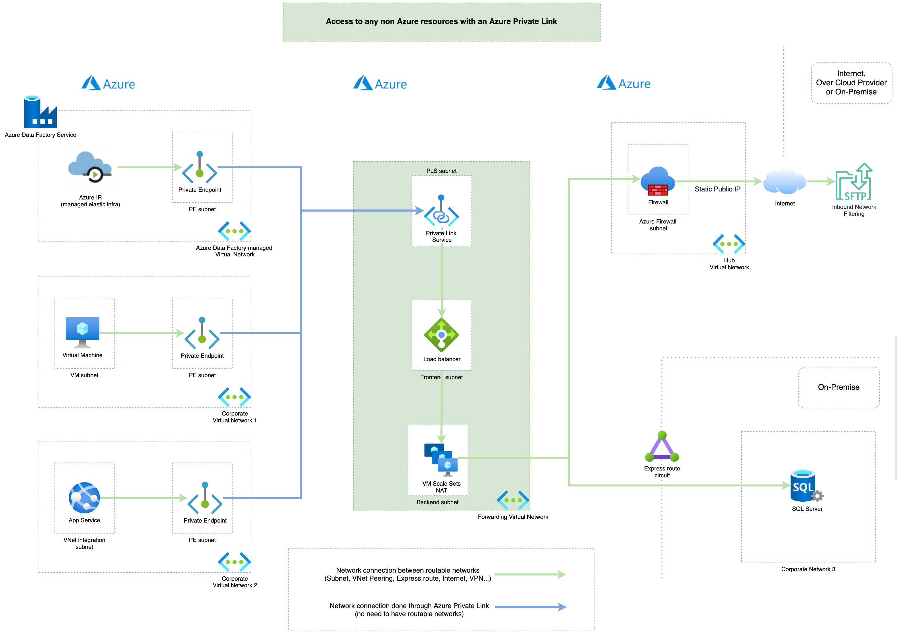

Test
-----

Content
-----
Use cases described in the following
article : [Access to any non Azure resources with an Azure Private Link (Terraform module)](https://medium.com/@jamesdld23/access-to-any-non-azure-resources-with-an-azure-private-link-b6129992dad9)
.

This module will create the following objects :

- [Azure Private Link Service](https://docs.microsoft.com/en-us/azure/private-link/private-link-service-overview?WT.mc_id=AZ-MVP-5003548)
- [Azure Standard Load Balancer](https://docs.microsoft.com/en-us/azure/private-link/create-private-link-service-portal?WT.mc_id=AZ-MVP-5003548#create-an-internal-load-balancer)
- [Azure Virtual Machine Scale Set with forwarding rules](https://docs.microsoft.com/en-us/azure/data-factory/tutorial-managed-virtual-network-on-premise-sql-server?WT.mc_id=AZ-MVP-5003548#creating-forwarding-rule-to-endpoint)

High Level View
-----

Requirement
-----
Terraform v1.3.4 and above.
AzureRm provider version v2.81.0 and above.

Examples
-----

| Name | Description |
|------|-------------|
| complete | Create a private link to reach sftp and sql servers. |

